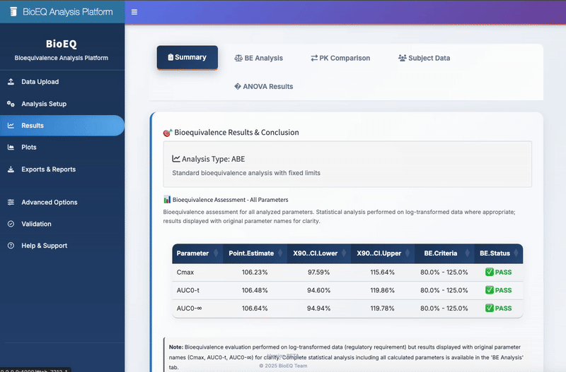

# BioEQ: Bioequivalence Analysis Platform

[](https://cran.r-project.org/)
[](LICENSE)
[]()
[]()

## 🎯 Overview

BioEQ is a comprehensive R package and Shiny application for bioequivalence analysis, providing regulatory-compliant statistical analysis for pharmaceutical studies. BioEQ offers both programmatic R functions and an intuitive web interface.


## ✨ Planned Features

- **Regulatory Compliance**: FDA, EMA, and ICH M13A guideline adherence
- **Comprehensive Analysis**: NCA, ANOVA, and bioequivalence assessment
- **Study Designs**: 2×2×2 crossover, parallel, replicate designs
- **Web Interface**: Professional Shiny application with drag-and-drop data upload
- **Report Generation**: Automated regulatory-compliant reports in multiple formats
- **Validation**: Cross-validated with industry-standard software (WinNonlin, SAS)



## 🚀 Quick Start

### Installation

```r
# Option 1: Install dependencies automatically
Rscript install_dependencies.R

# Option 2: Install manually
install.packages(c("shiny", "shinydashboard", "DT", "readr", "dplyr", 
                   "readxl", "bslib", "ggplot2", "gridExtra"))

# Option 3: Future - Install from GitHub (when package is complete)
# devtools::install_github("yourusername/BioEQ")
```

### Basic Usage

#### R Package
```r
# Load example data
data <- read.csv("your_data.csv")

# Run NCA analysis
nca_results <- calculate_pk_parameters(data)

# Perform bioequivalence analysis
be_results <- run_bioequivalence_analysis(nca_results)

# Generate report
generate_report(be_results, format = "pdf")
```

#### Shiny Application
```r
# Method 1: One-command launch (easiest)
Rscript launch_app.R

# Method 2: From command line with auto-install
cd shiny
R -e "options(repos = c(CRAN = 'https://cran.rstudio.com/')); shiny::runApp(host='0.0.0.0', port=4000, launch.browser=TRUE)"

# Method 3: From R console (ensure correct working directory)
setwd("shiny")
options(repos = c(CRAN = 'https://cran.rstudio.com/'))
shiny::runApp(host='0.0.0.0', port=4000, launch.browser=TRUE)

# Method 4: Using absolute path
shiny::runApp("/path/to/BioEQ/shiny", host='0.0.0.0', port=4000, launch.browser=TRUE)

# Future: Launch via package (when package is complete)
# BioEQ::launch_app()
```

**Access the app at:** http://localhost:4000

## 📊 Analysis Capabilities (In Development)

### Non-Compartmental Analysis (NCA)
- AUC (linear, log-linear, mixed methods)
- Cmax, Tmax determination
- Terminal half-life calculation
- Clearance and volume parameters

### Statistical Analysis
- ANOVA with fixed and random effects
- 90% confidence intervals
- Geometric mean ratios
- Intra-subject variability

### Bioequivalence Assessment
- 80-125% acceptance criteria
- Scaled average bioequivalence
- Reference-scaled approaches
- Outlier detection

## 📋 Data Requirements

### Concentration-Time Data
- Columns: Subject, Treatment, Period, Sequence, Time, Concentration
- Formats: CSV, Excel, tab-delimited

### PK Parameters Data
- Pre-calculated AUC, Cmax, Tmax values
- Direct bioequivalence assessment

## 🛠️ Development

### Prerequisites
- R (≥ 4.0.0)
- RStudio (recommended)
- Required packages: See [DESCRIPTION](DESCRIPTION)

### Testing
```r
# Run unit tests
devtools::test()

# Check package
devtools::check()
```

## 📚 Documentation (In Development)

- [User Guide](docs/user_guide.md)
- [API Reference](https://github.com/BioEQ/)
- [Shiny App Guide](shiny/README.md)
- [Validation Report](VALIDATION_REPORT.md)

## 📄 License

This project is licensed under the MIT License - see [LICENSE](LICENSE) for details.

## 👥 Authors

- BioEQ Development Team

## 🙏 Acknowledgments

- R Consortium for statistical computing
- Regulatory agencies for guidance documents

## 📞 Support

- **Issues**: [GitHub Issues](https://github.com/yourusername/BioEQ/issues)
- **Discussions**: [GitHub Discussions](https://github.com/yourusername/BioEQ/discussions)
- **Email**: support@bioeq.org

## 📈 Citation

If you use BioEQ in your research, please cite:

```
BioEQ Development Team (2025). BioEQ: Bioequivalence Analysis Platform. 
```

---
Author: Amanda Lewin
*Version BETA 
