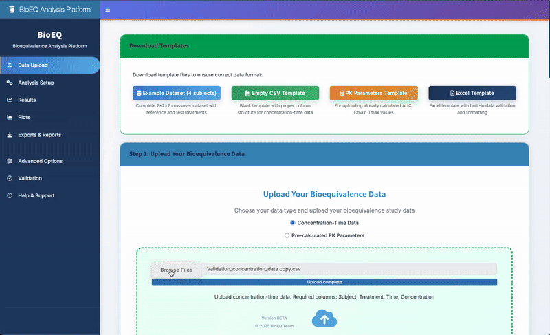
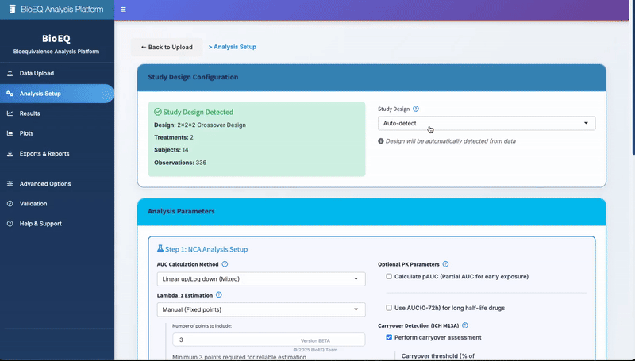
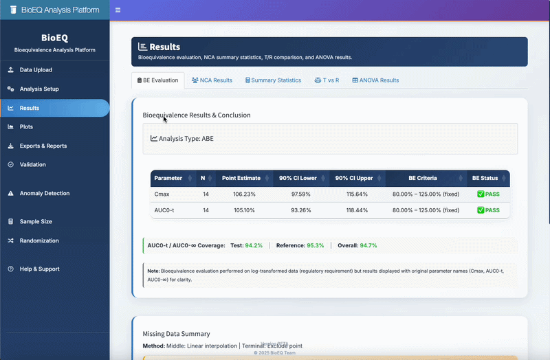
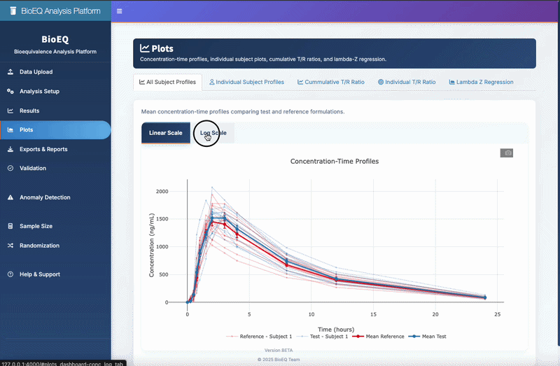

# BioEQ: Bioequivalence Analysis Platform

[](https://cran.r-project.org/)
[](LICENSE)
[]()

## Overview

BioEQ is a Shiny-based bioequivalence analysis platform providing regulatory-compliant NCA, statistical analysis, and reporting for pharmaceutical studies. It is designed for both scientists who want a point-and-click interface and R users who want direct access to the underlying functions.

---

## Application Modules

### Data Upload
Upload concentration-time data or pre-calculated PK parameter datasets. The upload module validates column structure, detects study design, and previews the data before analysis.



### Analysis Setup
Configure the full analysis pipeline: study design, NCA calculation method, ANOVA model, and BE assessment type.

- **Study designs**: 2×2×2 crossover, 2×2×3 replicate, 2×2×4 replicate, parallel group (auto-detected or manually set)
- **AUC methods**: Linear trapezoidal, log trapezoidal, mixed linear/log trapezoidal
- **ANOVA models**: Fixed effects (`lm`), mixed effects (`nlme`)
- **BE analysis types**: Average BE (ABE), Reference-Scaled ABE (RSABE), Average BE with Expanding Limits (ABEL)
- **Carryover assessment**: ICH M13A-compliant detection (crossover designs)
- **Missing data**: BLQ → 0 imputation, middle-point interpolation, terminal LOCF



### Results
The results dashboard is organized across five tabs:

- **Summary** — BE assessment conclusion for primary PK parameters, missing data summary, and carryover assessment (if applicable)
- **BE Analysis** — Full bioequivalence analysis with 90% CIs and geometric mean ratios
- **PK Comparison** — Individual and mean T/R ratios with Test vs. Reference data
- **Subject Data** — Per-subject NCA parameter table with selectable columns
- **ANOVA Results** — Full ANOVA table with variance components



### Plots
Interactive and static visualizations of study data.

- Concentration-time profiles (linear and semi-log)
- Test/Reference overlay plots
- Individual and cumulative T/R ratio plots
- Period and sequence effect diagnostics



### Exports & Reports
Export results and generate regulatory-ready reports.

- **Data exports**: CSV, Excel
- **Reports**: PDF, HTML (Word requires optional `officer`/`flextable` packages)
- **Plots**: High-resolution static graphics
- **R script**: Reproducible analysis code

### Validation
Built-in black-box validation engine that benchmarks BioEQ results against embedded reference datasets derived from industry-standard software. Validation runs within the app — no filesystem access or external files needed.

### Anomaly Detection
Automated tools for flagging anomalous concentration-time profiles, outlier NCA parameters, and subject-level data quality issues. Includes pairwise profile comparison, trend analysis, and distributional checks. Data can be uploaded directly within the module without needing to run a full analysis.

### Sample Size
Power and sample size estimation for bioequivalence studies via the `PowerTOST` package, supporting ABE, RSABE (FDA Linearized, ncTOST), and ABEL designs. Results are automatically passed to the Randomization module via the autofill feature.

### Randomization
Full treatment sequence randomization for BE studies. Reproducible from seed, auditable, and verifiable.

- **Designs supported**: Parallel (T vs R), 2×2 Crossover, 2×2×3 Replicate (TRT|RTR), 2×2×4 Full Replicate (TRTR|RTRT), 2×3×3 Partial Replicate
- **Generate Schedule**: Configure design, sample size, optional group (block) randomization, RNG seed, optional stratification, and subject ID prefix. Autofill from the Sample Size module in one click.
- **Verify Schedule**: Re-enter parameters from an audit record and optionally upload a CSV to confirm all assignments are identical to the regenerated schedule.
- **Report**: Downloadable plain-text audit record and self-contained HTML pharmacist report. Includes algorithm details (Mersenne-Twister), seed, R version, schedule hash (SHA-256), and all parameters required for regulatory submission.
- **Reproducibility**: Uses base R only (no package version dependencies in the random stream); RNGkind locked to `Mersenne-Twister/Inversion/Rejection` for R ≥ 3.6.

### Help & Support
Step-by-step guidance on data format requirements, workflow, and analysis interpretation.

---

## Quick Start

> **New to R?** Follow the beginner-friendly [Installation Guide](docs/INSTALLATION_GUIDE.md) instead — it walks through installing R, RStudio, and BioEQ from scratch with no prior experience required.

### Install Dependencies

```r
# Option 1: Automatic install
Rscript install_dependencies.R

# Option 2: Manual install (core)
install.packages(c(
  "shiny", "shinydashboard", "DT", "readr", "dplyr",
  "readxl", "bslib", "shinyjs", "shinycssloaders",
  "ggplot2", "gridExtra", "plotly", "htmlwidgets",
  "nlme", "lme4", "lmerTest", "replicateBE",
  "PowerTOST", "reshape2", "scales", "writexl", "tidyr",
  "rmarkdown", "knitr", "zip", "digest"
))

# Optional (Word report generation)
install.packages(c("officer", "flextable"))

# Optional (analysis enhancements: DTW similarity, Kenward-Roger DDF)
install.packages(c("dtw", "pbkrtest"))
```

### Launch the App

```r
# Recommended: from the BioEQ project root
Rscript launch_app.R

# Or from an R console
shiny::runApp("shiny", host = "127.0.0.1", port = 4000, launch.browser = TRUE)

# Or from the command line
cd /path/to/BioEQ
Rscript -e 'shiny::runApp("shiny", host="127.0.0.1", port=4000, launch.browser=TRUE)'
```

**Access the app at:** http://127.0.0.1:4000

---

## Data Format

### Concentration-Time Data
| Column | Description |
|---|---|
| `Subject` | Unique subject identifier |
| `Treatment` | Treatment code (`R` = Reference, `T` = Test) |
| `Period` | Study period number |
| `Sequence` | Treatment sequence (e.g., `RT`, `TR`) |
| `Time` | Sampling time (hours) |
| `Concentration` | Drug concentration (ng/mL or equivalent) |

Supported file formats: CSV, Excel (`.xlsx`), tab-delimited

### PK Parameters Data
Pre-calculated AUC, Cmax, and Tmax values per subject can be uploaded directly for BE assessment without running NCA.

---

## Analysis Methods

### Non-Compartmental Analysis (NCA)
- AUC<sub>0-t</sub> and AUC<sub>0-∞</sub> via linear, log, or mixed trapezoidal rules
- C<sub>max</sub> and T<sub>max</sub>
- Terminal elimination half-life (λ<sub>z</sub>)
- Apparent clearance (CL/F) and volume of distribution (Vz/F)

### Bioequivalence Assessment
| Method | Design | Regulatory Basis |
|---|---|---|
| Average BE (ABE) | 2×2×2, parallel | FDA, EMA, ICH M13A |
| RSABE — FDA Linearized (Howe UCB) | 2×2×3, 2×2×4 replicate | FDA Guidance (2021), HVD/HVDP |
| RSABE — ncTOST | 2×2×3, 2×2×4 replicate | Tóthfalusi & Endrényi (2016) |
| ABEL | 2×2×3, 2×2×4 replicate | EMA Guideline |

### Statistical Analysis
- ANOVA: fixed effects (`lm`) and mixed effects (`nlme`)
- 90% confidence intervals on geometric mean ratios
- Intra-subject coefficient of variation (CV<sub>wR</sub>)
- Carryover detection per ICH M13A Section 2.2.3.3

---

## Project Structure

```
BioEQ/
├── R/                        # Core analysis functions
│   ├── bioeq_main.R          # Main pipeline orchestration
│   ├── nca_functions.R       # NCA calculations
│   ├── be_analysis.R         # ABE / study-design routing
│   ├── rsabe_analysis.R      # RSABE & ABEL methods
│   ├── simple_anova.R        # ANOVA models
│   ├── carryover_detection.R # ICH M13A carryover detection
│   ├── cumulative_be_analysis.R # Progressive cumulative BE
│   ├── missing_data_handling.R  # BLQ/missing data strategies
│   ├── plotting.R            # Static & interactive plots
│   ├── randomization.R       # BE randomization engine (base R, reproducible)
│   ├── statistics.R          # Sample size & power functions
│   ├── utils.R               # Shared utilities
│   └── validation_runner.R   # Black-box validation engine
├── shiny/
│   ├── app.R                 # Application entry point
│   ├── ui/                   # Module UIs
│   ├── server/               # Module servers
│   ├── utils/                # Dashboard & report helpers
│   ├── templates/            # Report templates (Rmd)
│   └── www/                  # Static assets (CSS)
├── validation/               # Validation reference data & scripts
├── docs/                     # User guide and images
├── tests/                    # Unit tests
├── DESCRIPTION
├── install_dependencies.R
└── launch_app.R
```

---

## Roadmap

- **Expanded reporting** — Full Word report support (requires optional `officer`/`flextable` packages)
- **Additional study designs** — Higher-order crossover and multi-dose designs
- **DTW pairwise comparison** — Dynamic Time Warping for anomaly detection (requires optional `dtw` package)

---

## License

MIT — see [LICENSE](LICENSE) for details.

## Authors

BioEQ Development Team

## Documentation

- [User Guide](docs/user_guide.md)
- [Shiny App Guide](shiny/README.md)

---

*Version BETA*
